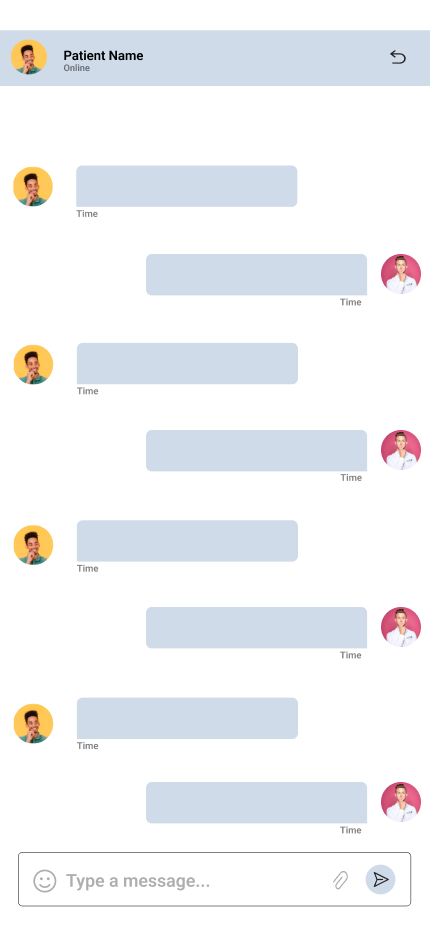
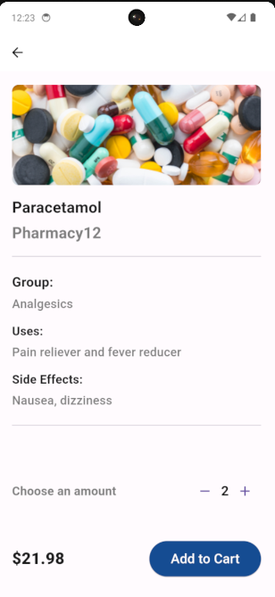
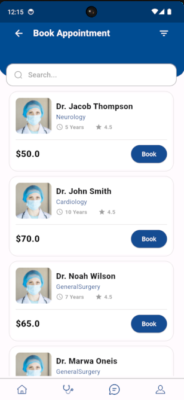
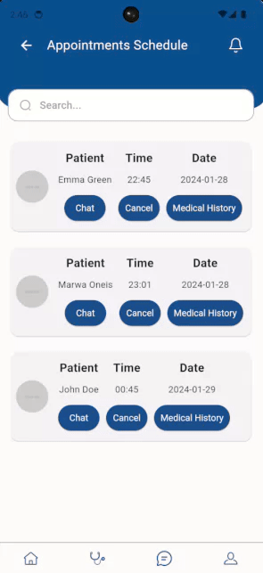
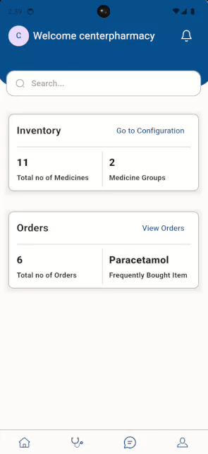
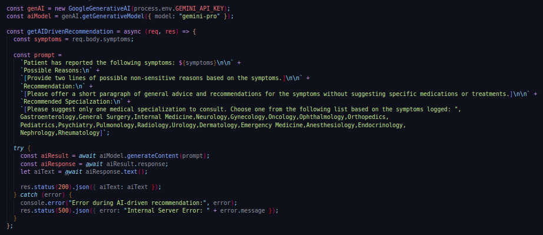

<br><br>

<!-- project philosophy -->


> A Progressive Healthcare Management System mobile application that connects between patients, doctors, and health care providers.
>
> MedConnect is an application designed to benefit patients, doctors, and healthcare providers. Patients enjoy convenience with features like virtual consultations, an AI-assisted symptom checker, and automated medication reminders. Doctors benefit from more efficient workflows and improved communication. Hospitals and medical centers witness increased administrative efficiency, leading to an overall enhancement of patient care effectiveness.

https://github.com/marwaoneis/med-connect/assets/110203332/70bf384e-d000-41ac-a0f8-94b79d586244

### User Stories

Patient

- As a patient, I want to effortlessly request medication refills through the app, so I can ensure a smooth process and timely access to my prescriptions.
- As a patient experiencing symptoms, I want to input my symptoms into the app's Symptom Checker, receiving AI-powered assessments and suggestions for appropriate next steps, so I can better understand and manage my health.
- As a patient, I want the option for virtual consultations with doctors through the Tele-medicine feature, providing a convenient and flexible healthcare experience without the need to physically visit a clinic.

Doctor

- As a doctor, I want to conduct virtual consultations with patients through the Tele-medicine feature, so I can provide a flexible and efficient way to deliver healthcare services.
- As a healthcare provider, I want to efficiently manage appointments through the app, so I can ensure a smooth scheduling process and effective use of my time.
- As a doctor, I want to electronically prescribe medications to patients through the app, so I can simplify the prescription process and improve coordination with pharmacies.

Pharmacy

- As a pharmacy Representative, I want to seamlessly integrate with the app to receive electronic prescriptions and coordinate efficiently with healthcare providers, so I can ensure accurate and timely medication dispensing.
- As a pharmacy Representative, I want to receive and process medication refill requests from patients through the app, streamlining the refill process and enhancing customer service.

  <br><br>

<!-- Tech stack -->
 

### MedConnect is built using a combination of modern technologies. Below is an overview of the key technologies employed in the development of MedConnect.

- **Framework**: [Flutter](https://flutter.dev/) is a versatile and powerful cross-platform framework that allows us to develop MedConnect with a single codebase for both mobile and web platforms.
- **Language**: [Dart](https://dart.dev/) is used as the primary programming language, complementing Flutter for a smooth and responsive UI.
- **Platform**: [Firebase](https://firebase.google.com/) for real-time chatting features are powered by Firebase. We are currently working on integrating Firebase for robust and efficient push notifications.
- **Technology**: [NodeJS](https://nodejs.org/). Its purpose is utilized for its efficient handling of asynchronous events and high throughput, which powers the server-side of MedConnect.
- **Database**: [MongoDB](https://www.mongodb.com/) used for its flexible data storage capabilities, aiding in the efficient management and retrieval of data.
- **Framework**: [Express](https://expressjs.com/) is integrated as a back-end web application framework for Node.js, simplifying the server-side logic and routing for MedConnect.

> 🚨 **Note**:I am actively working on refining the notification system for an improved user experience.

MedConnect employs material design principles for its UI, offering an intuitive and user-friendly interface. The primary font used is tailored to ensure readability and visual appeal.

Stay connected with us for more updates and enhancements on MedConnect!

<br><br>

<!-- UI UX -->


> In designing MedConnect, we employed a meticulous approach, starting with detailed wireframes and progressing to comprehensive mockups. This iterative design process was instrumental in refining the user interface, ensuring that each layout was optimized for ease of navigation and a seamless user experience. Our dedication to this process has culminated in an intuitive design that not only meets but exceeds the expectations of our users.

### Mockups Examples

| Info Screen                       | Chating Screen                   | Doctor Dashboard Screen                          |
| --------------------------------- | -------------------------------- | ------------------------------------------------ |
|  |  |  |

- Check more mockups on [Figma...](https://www.figma.com/file/ecj29Eu5rKlfrUcjcrX4Gu/UI-UX-Final-Project---MedConnect?type=design&node-id=184%3A36&mode=design&t=WI17ii4fHIhcSCn1-1)

<br><br>

<!-- Database Design -->


### Architecting Data Excellence: Innovative Database Design Strategies:


<br><br>

<!-- Implementation -->


### Patient Screens

| Patient Home Screen                             | Patient Profile Screen                     | Symptom Checker Screen                       |
| ----------------------------------------------- | ------------------------------------------ | -------------------------------------------- |
|  |  |   |
| Medicine Info Screen                            | Buy Medicine List Screen                   | Doctors List Screen                          |
|      |    |  |

### Doctor Screens

| Doctor Dashboard screen                        | Appointments Schedule Screen         | Confirm Appointment and Chat Screen      |
| ---------------------------------------------- | ------------------------------------ | ---------------------------------------- |
|  |  |  |

### Pharmacy Screens

| Pharmacy Dashboard screen                        | Medicines List Screen                       | Medicines Group Screen                   |
| ------------------------------------------------ | ------------------------------------------- | ---------------------------------------- |
|  |  |  |

<br><br>

<!-- Prompt Engineering -->


### Enhancing AI Capabilities with Google Gemini and Prompt Engineering:

- This project leverages the sophisticated capabilities of Google Gemini in AI implementation, significantly enhancing our interaction with natural language processing models. By employing refined prompt engineering strategies, we have customized the AI's responsiveness to understand and generate language more precisely and efficiently for diverse tasks. A key feature developed using this approach is our symptom checker. This intuitive tool patiently waits for users to describe their health symptoms or feelings. Upon receiving this input, the AI analyzes it to suggest potential causes, offer recommendations, and even identify suitable specialists for consultation. Below is a screenshot demonstrating the specific prompt used to achieve this functionality.

| Google Gemini prompt                                      |
| --------------------------------------------------------- |
|  |

<br><br>

<!-- AWS Deployment -->


### Efficient AI Deployment: Unleashing the Potential with AWS Integration:

- We chose AWS for our project due to its scalability and reliability, essential for handling growing demands and ensuring consistent performance. AWS's tools accelerate development and enhance security, crucial for our AI applications. At the end, a list of commands used for deploying this project on AWS is provided.

1.  Connecting to Your EC2 Instance:
    ```sh
    ssh -i /path/to/my-key.pem ec2-user@my-ec2-ip-address
    ```
2.  Installing Node.js on EC2:
    - Update the package repository:
      ```sh
      sudo yum update -y
      ```
    - Install Node.js:
      ```sh
      sudo yum install -y nodejs
      ```
3.  Setting Up MongoDB:
    - Install MongoDB:
    ```sh
    sudo yum install -y mongodb-org
    ```
    - Start MongoDB:
    ```sh
    sudo systemctl start mongod
    ```
4.  Install git , to clone the repo from github
    ```sh
    sudo yum install -y git
    ```
5.  After cloning:
    - Navigate to my project directory and install dependencies:
    ```sh
    npm install
    ```
    - Start my Node.js application:
    ```sh
    node index.js
    ```

<br><br>

<!-- Unit Testing -->


### Precision in Development: Harnessing the Power of Unit Testing:

- This project employs rigorous unit testing methodologies to ensure the reliability and accuracy of code components. By systematically evaluating individual units of the software, we guarantee a robust foundation, identifying and addressing potential issues early in the development process.

| Features testing                                  |
| ------------------------------------------------- |
|  |

<br><br>

<!-- How to run -->


> To set up MedConnect locally, follow these steps:

### Prerequisites

This is an example of how to list things you need to use the software and how to install them.

- npm
  ```sh
  npm install npm@latest -g
  ```

### Installation

_Below is an example of how you can instruct your audience on installing and setting up your app. This template doesn't rely on any external dependencies or services._

1. Clone the repo
   ```sh
   git clone https://github.com/marwaoneis/med-connect.git
   ```
2. Install [Node.js](https://nodejs.org/en/)
3. Install NPM packages
   ```sh
   npm install
   ```
4. Go to server directory
   ```sh
   cd server
   ```
5. Enter your URI in `monoDb.configs.js`
   ```js
   MONGODB_URI = "ENTER YOUR URI";
   ```
6. Get a free API Key at [Google API](https://makersuite.google.com/app/apikey)
7. Enter your API in `config.js`
   ```js
   const API_KEY = "ENTER YOUR API";
   ```
8. Run the server
   ```sh
   nodemon .
   ```
9. Install [Flutter SDK](https://docs.flutter.dev/get-started/install?gclid=Cj0KCQiAveebBhD_ARIsAFaAvrEXbca0gKEuW9ROxwC86eiEtJUUO5tm-AIIzds41AXpzsjkbESCw2EaAsTwEALw_wcB&gclsrc=aw.ds)
10. Go to flutter_app directory
    ```sh
    cd flutter_app
    ```
11. Run flutter_app
    ```sh
    flutter run
    ```

Now, you should be able to run MedConnect locally and explore its features.
