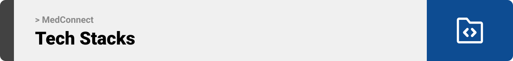
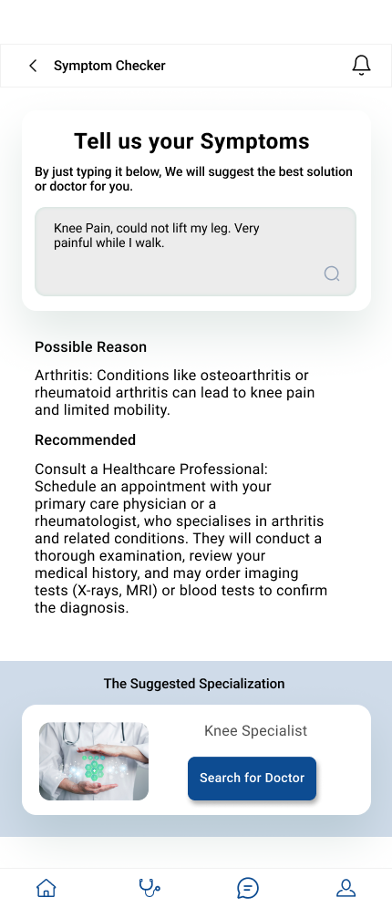

<br><br>

<!-- project philosophy -->


> A Progressive Healthcare Management System mobile application that connects between patients, doctors, and health care providers.
>
> MedConnect is an application designed to benefit patients, doctors, and healthcare providers. Patients enjoy convenience with features like virtual consultations, an AI-assisted symptom checker, and automated medication reminders. Doctors benefit from more efficient workflows and improved communication. Hospitals and medical centers witness increased administrative efficiency, leading to an overall enhancement of patient care effectiveness.

### User Stories

Patient:

- As a patient, I want to effortlessly request medication refills through the app, so I can ensure a smooth process and timely access to my prescriptions.
- As a patient experiencing symptoms, I want to input my symptoms into the app's Symptom Checker, receiving AI-powered assessments and suggestions for appropriate next steps, so I can better understand and manage my health.
- As a patient, I want the option for virtual consultations with doctors through the Tele-medicine feature, providing a convenient and flexible healthcare experience without the need to physically visit a clinic.

Doctor:

- As a doctor, I want to conduct virtual consultations with patients through the Tele-medicine feature, so I can provide a flexible and efficient way to deliver healthcare services.
- As a healthcare provider, I want to efficiently manage appointments through the app, so I can ensure a smooth scheduling process and effective use of my time.
- As a doctor, I want to electronically prescribe medications to patients through the app, so I can simplify the prescription process and improve coordination with pharmacies.

Pharmacy:

- As a pharmacy, I want to seamlessly integrate with the app to receive electronic prescriptions and coordinate efficiently with healthcare providers, so I can ensure accurate and timely medication dispensing.
- As a pharmacy, I want to receive and process medication refill requests from patients through the app, streamlining the refill process and enhancing customer service.

  <br><br>

<!-- Tech stack -->
 

### MedConnect is built using a combination of modern technologies. Below is an overview of the key technologies employed in the development of MedConnect.

- **Framework**: [Flutter](https://flutter.dev/)
- **Description**: Flutter is a versatile and powerful cross-platform framework that allows us to develop MedConnect with a single codebase for both mobile and web platforms.
- **Language**: [Dart](https://dart.dev/) is used as the primary programming language, complementing Flutter for a smooth and responsive UI.
- **Platform**: [Firebase](https://firebase.google.com/) for real-time chatting features are powered by Firebase. We are currently working on integrating Firebase for robust and efficient push notifications.
- **Technology**: [NodeJS](https://nodejs.org/). Its purpose is utilized for its efficient handling of asynchronous events and high throughput, which powers the server-side of MedConnect.
- **Database**: [MongoDB](https://www.mongodb.com/) used for its flexible data storage capabilities, aiding in the efficient management and retrieval of data.
- **Framework**: [Express](https://expressjs.com/) is integrated as a back-end web application framework for Node.js, simplifying the server-side logic and routing for MedConnect.

> 🚨 **Note**:I am actively working on refining the notification system for an improved user experience.

MedConnect employs material design principles for its UI, offering an intuitive and user-friendly interface. The primary font used is tailored to ensure readability and visual appeal.

Stay connected with us for more updates and enhancements on MedConnect!

<br><br>

<!-- UI UX -->


> In designing MedConnect, we employed a meticulous approach, starting with detailed wireframes and progressing to comprehensive mockups. This iterative design process was instrumental in refining the user interface, ensuring that each layout was optimized for ease of navigation and a seamless user experience. Our dedication to this process has culminated in an intuitive design that not only meets but exceeds the expectations of our users.

- Project Figma design [figma](https://www.figma.com/file/ecj29Eu5rKlfrUcjcrX4Gu/UI-UX-Final-Project---MedConnect?type=design&node-id=184%3A36&mode=design&t=WI17ii4fHIhcSCn1-1)

### Mockups

| Patient Home Screen                       | Book Appointment Screen                         | Symptom Checker Screen                      |
| ----------------------------------------- | ----------------------------------------------- | ------------------------------------------- |
|  |  |  |

<br><br>

| Patient Profile Screen                       | Medical History Screen                           | Chating Screen                   |
| -------------------------------------------- | ------------------------------------------------ | -------------------------------- |
|  |  |  |

<br><br>

| Doctor Dashboard Screen                          | Appointments Schedule Screen Screen      | Medicine List Screen                      |
| ------------------------------------------------ | ---------------------------------------- | ----------------------------------------- |
|  |  |  |

<br><br>

<!-- Database Design -->


### Architecting Data Excellence: Innovative Database Design Strategies:


<br><br>

<!-- Implementation -->


### Common User Screens (Mobile)

| Welcome Screen                               | Info Screen 1                         | Info Screen 2                         | Info Screen 3                           |
| -------------------------------------------- | ------------------------------------- | ------------------------------------- | --------------------------------------- |
|  |      |      |        |
| Login Screen                                 | First Register Screen                 | Second Register Screen                | Forget Password Screen                  |
|    |  |  |  |

### Patient User Screens (Mobile)

| Login Screen                                      | Register Screen                              | Register Screen                        | Dashboard Screen                            |
| ------------------------------------------------- | -------------------------------------------- | -------------------------------------- | ------------------------------------------- |
|                |        |  |      |
| Doctors List Screen                               | Book Appointment Screen                      | Specific Doctor Speciality Screen      | Symptom Checker Screen                      |
|  |  |  |  |

### Admin Screens (Web)

| Login screen                            | Register screen                       | Landing screen                        |
| --------------------------------------- | ------------------------------------- | ------------------------------------- |
|  |  |  |
| Home screen                             | Menu Screen                           | Order Screen                          |
|  |  |  |

<br><br>

<!-- Prompt Engineering -->


### Mastering AI Interaction: Unveiling the Power of Prompt Engineering:

- This project uses advanced prompt engineering techniques to optimize the interaction with natural language processing models. By skillfully crafting input instructions, we tailor the behavior of the models to achieve precise and efficient language understanding and generation for various tasks and preferences.

<br><br>

<!-- AWS Deployment -->


### Efficient AI Deployment: Unleashing the Potential with AWS Integration:

- This project leverages AWS deployment strategies to seamlessly integrate and deploy natural language processing models. With a focus on scalability, reliability, and performance, we ensure that AI applications powered by these models deliver robust and responsive solutions for diverse use cases.

<br><br>

<!-- Unit Testing -->


### Precision in Development: Harnessing the Power of Unit Testing:

- This project employs rigorous unit testing methodologies to ensure the reliability and accuracy of code components. By systematically evaluating individual units of the software, we guarantee a robust foundation, identifying and addressing potential issues early in the development process.

<br><br>

<!-- How to run -->


> To set up MedConnect locally, follow these steps:

### Prerequisites

This is an example of how to list things you need to use the software and how to install them.

- npm
  ```sh
  npm install npm@latest -g
  ```

### Installation

_Below is an example of how you can instruct your audience on installing and setting up your app. This template doesn't rely on any external dependencies or services._

1. Clone the repo
   ```sh
   git clone https://github.com/marwaoneis/med-connect.git
   ```
2. Install [Node.js](https://nodejs.org/en/)
3. Install NPM packages
   ```sh
   npm install
   ```
4. Go to server directory
   ```sh
   cd server
   ```
5. Enter your URI in `monoDb.configs.js`
   ```js
   MONGODB_URI = "ENTER YOUR URI";
   ```
6. Get a free API Key at [Google API](https://makersuite.google.com/app/apikey)
7. Enter your API in `config.js`
   ```js
   const API_KEY = "ENTER YOUR API";
   ```
8. Run the server
   ```sh
   nodemon .
   ```
9. Install [Flutter SDK](https://docs.flutter.dev/get-started/install?gclid=Cj0KCQiAveebBhD_ARIsAFaAvrEXbca0gKEuW9ROxwC86eiEtJUUO5tm-AIIzds41AXpzsjkbESCw2EaAsTwEALw_wcB&gclsrc=aw.ds)
10. Go to flutter_app directory
    ```sh
    cd flutter_app
    ```
11. Run flutter_app
    ```sh
    flutter run
    ```

Now, you should be able to run MedConnect locally and explore its features.
