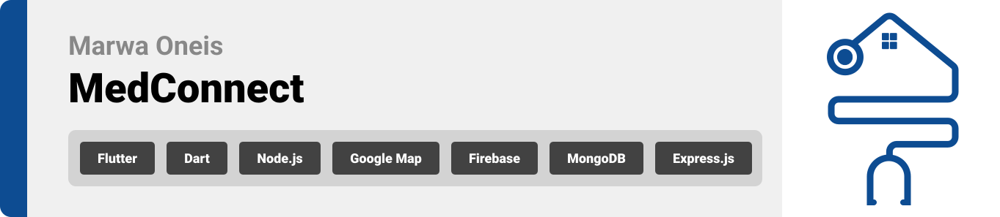

<br><br>

<!-- project philosophy -->


> A Progressive Healthcare Management System, an application that connects between patients, doctors, and health care providers.
>
> MedConnect is an application designed to benefit patients, doctors, and healthcare providers. Patients enjoy convenience with features like virtual consultations, an AI-assisted symptom checker, and automated medication reminders. Doctors benefit from more efficient workflows and improved communication. Hospitals and medical centers witness increased administrative efficiency, leading to an overall enhancement of patient care effectiveness.

### User Stories

- As a patient, I want to effortlessly request medication refills through the app, so I can ensure a smooth process and timely access to my prescriptions.
- As a user seeking health information, I want to interact with the ChatBot to receive accurate and helpful responses to basic health queries, so I can make precise decisions about my health.
- As a doctor, I want to conduct virtual consultations with patients through the Tele-medicine feature, so I can provide a flexible and efficient way to deliver healthcare services.
- As a pharmacy, I want to seamlessly integrate with the app to receive electronic prescriptions and coordinate efficiently with healthcare providers, so I can ensure accurate and timely medication dispensing.

<br><br>

<!-- Prototyping -->


> We designed MedConnect using wireframes and mockups, iterating on the design until we reached the ideal layout for easy navigation and a seamless user experience.

### Wireframes

| Login screen                            | Register screen                       | Landing screen                        |
| --------------------------------------- | ------------------------------------- | ------------------------------------- |
|  |  |  |

### Mockups

| Home screen                             | Menu Screen                           | Order Screen                          |
| --------------------------------------- | ------------------------------------- | ------------------------------------- |
|  |  |  |

<br><br>

<!-- Implementation -->


> Using the wireframes and mockups as a guide, we implemented the MedConnect app with the following features:

### User Screens (Mobile)

| Login screen                              | Register screen                         | Landing screen                          | Loading screen                          |
| ----------------------------------------- | --------------------------------------- | --------------------------------------- | --------------------------------------- |
|  |  |  |  |
| Home screen                               | Menu Screen                             | Order Screen                            | Checkout Screen                         |
|  |  |  |  |

### Admin Screens (Web)

| Login screen                            | Register screen                       | Landing screen                        |
| --------------------------------------- | ------------------------------------- | ------------------------------------- |
|  |  |  |
| Home screen                             | Menu Screen                           | Order Screen                          |
|  |  |  |

<br><br>

<!-- Tech stack -->


### MedConnect is built using the following technologies:

- This project uses the [Flutter app development framework](https://flutter.dev/). Flutter is a cross-platform hybrid app development platform which allows us to use a single codebase for apps on mobile, desktop, and the web.
- For persistent storage (database), the app uses the [MongoDB](https://hivedb.dev/) package which allows the app to create a custom storage schema and save it to a local database.
- To send local push notifications, the app uses the [flutter_local_notifications](https://pub.dev/packages/flutter_local_notifications) package which supports Android, iOS, and macOS.
  - 🚨 Currently, notifications aren't working on macOS. This is a known issue that we are working to resolve!
- The app uses the font ["Work Sans"](https://fonts.google.com/specimen/Work+Sans) as its main font, and the design of the app adheres to the material design guidelines.

<br><br>

<!-- How to run -->


> To set up MedConnect locally, follow these steps:

### Prerequisites

This is an example of how to list things you need to use the software and how to install them.

- npm
  ```sh
  npm install npm@latest -g
  ```

### Installation

_Below is an example of how you can instruct your audience on installing and setting up your app. This template doesn't rely on any external dependencies or services._

1. Get a free API Key at [https://example.com](https://example.com)
2. Clone the repo
   ```sh
   git clone https://github.com/marwaoneis/med-connect.git
   ```
3. Install NPM packages
   ```sh
   npm install
   ```
4. Enter your API in `config.js`
   ```js
   const API_KEY = "ENTER YOUR API";
   ```

Now, you should be able to run MedConnect locally and explore its features.
